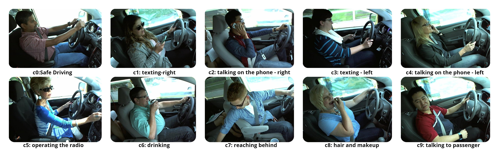

# Machine Learning Techniques for Distracted Driver Detection
Driving a car is a complex task, and it requires complete attention. Distracted driving is any activity that takes away the driver’s attention from the road. Approximately 1.35 million people die each year as a result of road traffic crashes.
Road traffic crashes cost most countries 3% of their gross domestic product So, our aim/goal in this project is to detect if the car driver is driving safe or performing any activity that might result in an accident or any harm to others, by using various Machine Learning Models to classify the provided images into different categories of Distraction.
# Dataset
The dataset used is State Farm Distracted Driver Detection taken from https://www.kaggle.com/c/state-farm-distracted-driver-detection/data. 
The dataset has 22424 training images, 79727 testing images and has 10 classes. The images are coloured and are of size 640×480 pixels. The classes are labelled as follows:
c0: safe driving
c1: texting — right
c2: talking on the phone — right
c3: texting — left
c4: talking on the phone — left
c5: operating the radio
c6: drinking
c7: reaching behind
c8: hair and makeup
c9: talking to a passenger
Dataset Visualization

# Data Pre-processing
Images are resized to 64 × 64 × 3 using CV2 in order to improve the computing efficiency of the classifier.
Stratified splitting is used to split the dataset into 80:20 Training-Testing ratio. The training dataset is further split into 90:10 Training-Validation set.
Thus, the final training set has 16145 images; the final validation set has 1794 images and the final testing set has 4485 images.
